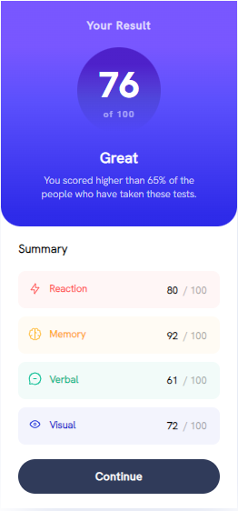
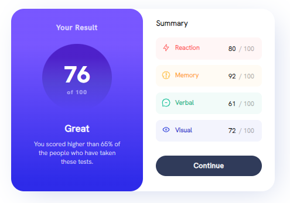

# Frontend Mentor - Results summary component

---

This is a solution to the [Results summary component](https://www.frontendmentor.io/challenges/results-summary-component-CE_K6s0maV).

### Screenshot

### Links

- Solution URL: [https://github.com/Namonaki0/FE-mentor-results-summary-component](https://github.com/Namonaki0/FE-mentor-results-summary-component)
- Live Site URL: [https://fementor-af-results-summary-component.netlify.app/](https://fementor-af-results-summary-component.netlify.app/)

## My process

### Built with

- Vue.JS
- CSS
- Flexbox
- CSS Grid
- Mobile-first workflow
- Media Queries

Netlify used for deployment.

## Author

- Website - [https://www.andreferreiradev.com/](https://www.andreferreiradev.com/)
- Frontend Mentor - [https://www.frontendmentor.io/profile/Namonaki0](https://www.frontendmentor.io/profile/Namonaki0)
- Github - [https://github.com/Namonaki0](https://github.com/Namonaki0)
